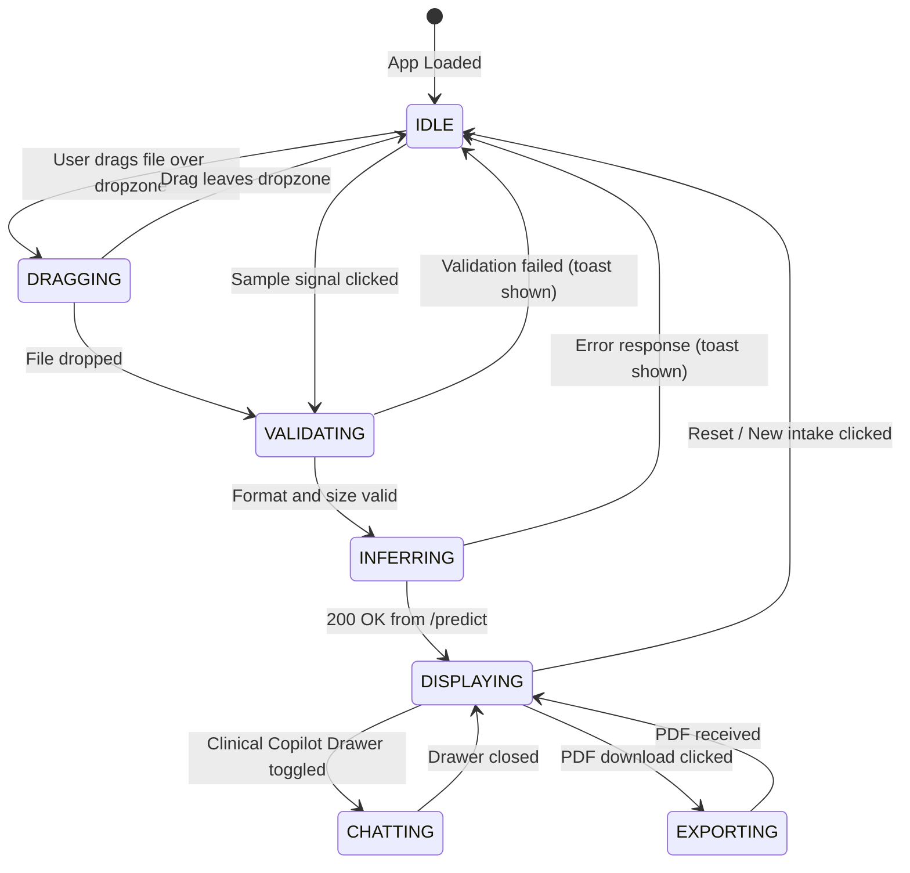
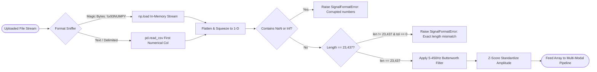
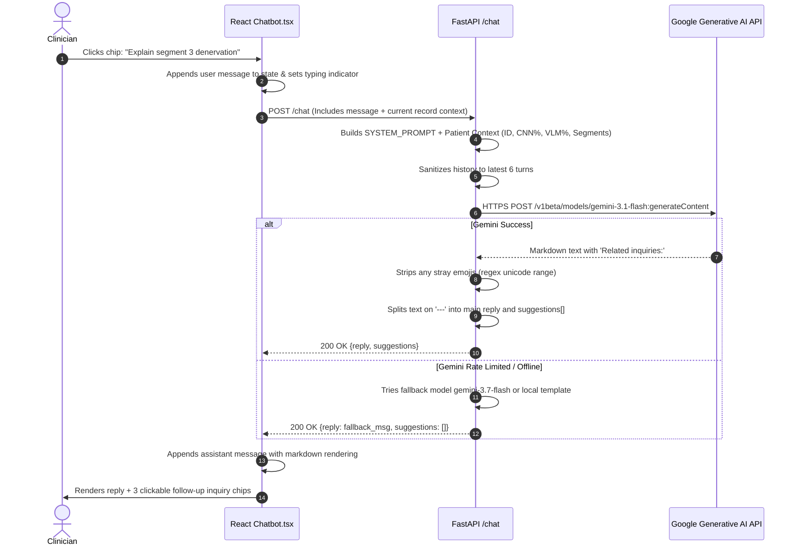

# Application & User Journey Flow
## EMG ALS Multi-Modal AI Screening Platform

*Document Version:* 1.1.0  
*Audience:* Frontend Engineers, UX Designers, Clinical Users  

---

## 1. End-to-End User Journey Workflow

```mermaid
flowchart TD
    Start([User Opens Web Application]) --> HealthCheck{Backend Health Probe}
    HealthCheck -->|Status: Ready| Dashboard[Render Main Screening Workspace]
    HealthCheck -->|Status: Degraded / Demo| DegradedBanner[Show Yellow Capability Banner] --> Dashboard
    HealthCheck -->|Status: Unavailable| ErrorScreen[Show 503 Service Initializing]

    Dashboard --> IntakeChoice{Choose Signal Source}
    IntakeChoice -->|Option A| DragDrop[Drag & Drop .npy or .csv File]
    IntakeChoice -->|Option B| BundleSample[Click Reference Sample e.g. ALS-01 / Normal-02]

    DragDrop --> ClientValidation{File Size <= 10MB?}
    ClientValidation -->|No| ClientError[Show Toast: Exceeds 10MB limit] --> Dashboard
    ClientValidation -->|Yes| SubmitInference[Send POST /predict]

    BundleSample --> SubmitInference

    SubmitInference --> LoadingState[Display Animated Multi-Stage Progress Skeleton]
    LoadingState --> ResultReceived{Inference Response 200 OK?}

    ResultReceived -->|No: 400 / 413 / 429 / 500| ErrorToast[Display Structured Error Toast & Dismiss] --> Dashboard
    ResultReceived -->|Yes| RenderResults[Render Interactive Clinical Findings]

    RenderResults --> View1[Verdict Card & Severity Indicator]
    RenderResults --> View2[Interactive 23,437-Point Waveform Canvas]
    RenderResults --> View3[1-D Grad-CAM Anomaly Regions & Peak]
    RenderResults --> View4[Tree SHAP Top Feature Attribution Bars]

    RenderResults --> UserAction{Select Downstream Action}
    UserAction -->|Action A: Inquire| OpenChat[Open Clinical Copilot Drawer]
    UserAction -->|Action B: Document| DownloadPDF[Download PDF Diagnostic Report]
    UserAction -->|Action C: New Patient| ResetState[Clear Cache & Load New Signal]

    OpenChat --> ChatInteraction[Ask Question or Click Suggested Inquiry]
    ChatInteraction --> GeminiResponse[Receive Strict Clinical Markdown Response]
    GeminiResponse --> DynamicSuggestions[Click Dynamic Follow-up Prompt] --> ChatInteraction

    DownloadPDF --> ReportGenerated[Browser Downloads als_report_{id}.pdf]
    ResetState --> Dashboard
```

---

## 2. Frontend State Machine Specification

The React single-page application orchestrates user interaction across eight discrete lifecycle states:



### 2.1 State Descriptions & Visual Cues

| State | Primary UI Elements | User Controls Enabled |
| :--- | :--- | :--- |
| **`IDLE`** | Drag-and-drop intake zone, sample chips, system status indicator | Upload dropzone, sample buttons, VLM toggle, Explain toggle |
| **`DRAGGING`** | Pulsing indigo dashed boundary, "Release file to evaluate" label | Drop target |
| **`INFERRING`** | Skeleton loading cards, multi-stage status text (*Analyzing waveform...*) | Abort request button |
| **`DISPLAYING`** | Verdict banner, high-resolution Canvas waveform, SHAP bars, Grad-CAM curve | Waveform zoom, segment inspection, chat button, PDF button |
| **`CHATTING`** | Sliding right-hand drawer, clinical message thread, suggested prompt chips | Chat input text field, clickable follow-up inquiry pills |
| **`EXPORTING`** | Spinner on PDF button (*Generating report...*) | Read-only view |

---

## 3. Signal Processing & Validation Logic



---

## 4. Clinical AI Assistant Conversational Turn Loop



---

## 5. Error Recovery & Edge Case Matrix

| Edge Case | Detection Point | Handling / Recovery Strategy |
| :--- | :--- | :--- |
| **GPU Out-of-Memory (OOM)** | Pipeline execution in PyTorch | Intercepted in `pipeline.py`; model tensors flushed with `torch.cuda.empty_cache()`; fast-path CNN returned with degraded flag. |
| **Corrupted Signal Data** | `signal_io.read_signal_bytes` | Returns clean HTTP 400 with message identifying row index of corrupted sample; no server stack trace leaked. |
| **Gemini API Key Missing** | `chat.generate_chat_response` | Non-blocking graceful degradation: Chat informs user that external LLM is offline, while diagnostic pipeline continues normally. |
| **Expired Diagnostic Record** | `store.load(record_id)` | If user requests a PDF after the 15-minute TTL, returns HTTP 404 with prompt to re-run the intake for patient safety. |
| **Network Interruption** | Frontend `api.ts` fetch wrapper | Catches fetch error; displays floating warning banner with "Retry Analysis" button preserving the selected file. |
