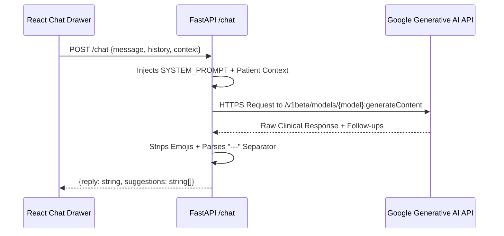

# Backend & Data Schema Specification
## EMG ALS Multi-Modal AI Screening Platform

*Document Version:* 1.1.0  
*Format:* OpenAPI 3.1 & Pydantic V2 Aligned Data Models  

---

## 1. REST API Endpoint Catalog

```mermaid
classDiagram
    class HealthEndpoints {
        +GET /health/live
        +GET /health/ready
        +GET /health
    }
    class PredictionEndpoints {
        +GET /samples
        +POST /predict
        +POST /predict/batch
    }
    class ArtifactEndpoints {
        +GET /report/{record_id}
        +GET /images/{name}
    }
    class AssistantEndpoints {
        +POST /chat
    }

    HealthEndpoints <|-- APIRouter
    PredictionEndpoints <|-- APIRouter
    ArtifactEndpoints <|-- APIRouter
    AssistantEndpoints <|-- APIRouter
```

| Method | Route | Description | Auth | Rate Limit |
| :--- | :--- | :--- | :--- | :--- |
| `GET` | `/health/live` | Process liveness check (no model dependency) | None | Unlimited |
| `GET` | `/health/ready` | Readiness probe for load balancer traffic admission | None | Unlimited |
| `GET` | `/health` | Full capability inspection, artifact paths, and device | None | Unlimited |
| `GET` | `/samples` | Enumerates bundled anonymized reference EMG samples | None | Unlimited |
| `POST` | `/predict` | Single signal scoring and multimodal fusion | None | 10 req/min |
| `POST` | `/predict/batch` | Cohort signal processing (up to 50 recordings) | None | 5 req/min |
| `GET` | `/report/{id}` | Generates and streams PDF diagnostic summary report | None | Unlimited |
| `GET` | `/images/{name}` | Ephemeral PNG visualization fetch (Grad-CAM, raster) | None | Unlimited |
| `POST` | `/chat` | Contextual neurophysiology Q&A with Clinical Copilot | None | 30 req/min |

---

## 2. The 838-Dimensional Meta-Learner Feature Vector

The multi-modal feature vector synthesized in `pipeline.build_meta_features` is the exact numeric input fed to the trained XGBoost meta-classifier (`meta_learner.pkl`).

### 2.1 Memory Map & Index Layout

```
+---------------------------------------------------------------------------------------------------+
|                            838-DIMENSIONAL FEATURE VECTOR LAYOUT                                  |
+-----------+---------------------+-------------------+---------------------------------------------+
| Indices   | Slice               | Dimensionality    | Clinical / Algorithmic Description          |
+-----------+---------------------+-------------------+---------------------------------------------+
| [0:3]     | CNN High-Level      | 3 Float32         | - [0]: Raw CNN Probability $P_{cnn}$        |
|           | Metrics             |                   | - [1]: Confidence $|P_{cnn} - 0.5|$         |
|           |                     |                   | - [2]: High-Confidence Gate ($\mathbb{I}>0.3$) |
+-----------+---------------------+-------------------+---------------------------------------------+
| [3:67]    | CNN Latent Features | 64 Float32        | Deep 1-D CNN penultimate linear layer       |
|           |                     |                   | embeddings capturing MUAP morphology        |
+-----------+---------------------+-------------------+---------------------------------------------+
| [67:69]   | Florence-2 Prob &   | 2 Float32         | - [67]: Florence-2 Sigmoid Prob $P_{vlm}$   |
|           | Confidence          |                   | - [68]: Confidence $|P_{vlm} - 0.5| \times 2$|
+-----------+---------------------+-------------------+---------------------------------------------+
| [69:837]  | Florence-2 Vision   | 768 Float32       | DaViT visual backbone pooled embedding     |
|           | Embeddings          |                   | capturing interference & recruitment pattern|
+-----------+---------------------+-------------------+---------------------------------------------+
| [837:838] | Inter-Model         | 1 Float32         | Boolean consensus indicator:                |
|           | Agreement           |                   | $\mathbb{I}[(P_{cnn} > 0.5) == (P_{vlm} > 0.5)]$ |
+-----------+---------------------+-------------------+---------------------------------------------+
```

---

## 3. Core Pydantic & TypeScript Schemas

### 3.1 `PredictionResult` Data Model

```python
class ShapFeature(BaseModel):
    feature: str           # e.g., "florence_emb_421" or "cnn_prob"
    label: str             # Human-readable label: "Vision Latent #421"
    value: float           # Marginal SHAP value (log-odds impact)
    direction: str         # "Supports ALS" | "Supports Normal"

class PredictionResult(BaseModel):
    id: str                                    # UUIDv4 record identifier
    source: str                                # File name or sample identifier
    final_prediction: Literal["ALS", "Normal"]  # Calibrated verdict
    final_probability: float                   # Range [0.0, 1.0]
    final_confidence: float                    # Range [0.5, 1.0]
    severity: Literal["Severe", "Moderate", "Mild", "N/A"]
    cnn_probability: float                     # Range [0.0, 1.0]
    cnn_prediction: Literal["ALS", "Normal"]
    florence_probability: float | None         # Null if VLM was toggled off
    florence_prediction: Literal["ALS", "Normal"] | None
    florence_confidence: float | None
    florence_caption: str | None               # Florence-2 generated description
    meta_probability: float | None             # XGBoost output
    models_agree: bool | None                  # Consensus indicator
    fusion: Literal["cnn_only", "cnn+florence", "cnn+florence+meta"]
    fusion_note: str | None
    abnormal_segments: str                     # e.g., "Seg 2, Seg 7"
    abnormal_segment_count: int
    n_segments: int                            # Default: 10
    segment_energies: list[float]              # 10 Normalized segment energy values
    signal_length: int                         # Fixed: 23,437 samples
    signal_image_url: str                      # Static URL: "/api/images/{id}_signal.png"
    gradcam_image_url: str | None              # Static URL: "/api/images/{id}_gradcam.png"
    gradcam_available: bool
    gradcam_profile: list[float] | None        # Downsampled 50-point temporal activation curve
    gradcam_peak_percent: float | None         # Timestamp percentage of maximal pathology
    top_shap_feature: str | None               # Highest magnitude driver
    top_shap_features: list[ShapFeature] | None # Top 5 driver features
    explanation: str                           # Clinically safe structured text
    explanation_source: str                    # "template" | "gemini"
    demo_mode: bool
    device: str                                # "cuda:0" | "cpu"
    disclaimer: str
    timings: dict[str, float]                  # Subsystem latencies in milliseconds
```

### 3.2 Clinical Chat Protocol (`/chat`)



#### Request Body (`ChatRequestBody`):
```json
{
  "message": "Why is segment 4 flagged as abnormal?",
  "history": [
    {
      "role": "user",
      "content": "What was the final verdict for this patient?"
    },
    {
      "role": "model",
      "content": "The screening platform classified this recording as ALS with 94.2% confidence (Severe category)."
    }
  ],
  "context": {
    "id": "78fa1b9e-9d8e-4a6a-a82f-2d431bb5e08c",
    "source": "patient_recording_004.npy",
    "final_prediction": "ALS",
    "final_confidence": 0.942,
    "severity": "Severe",
    "cnn_probability": 0.961,
    "florence_probability": 0.893,
    "models_agree": true,
    "abnormal_segments": "Seg 4, Seg 8",
    "top_shap_feature": "Florence Vision Latent #312"
  }
}
```

#### Response Body:
```json
{
  "reply": "Segment 4 (samples 7,031 to 9,374) displays root-mean-square energy exceeding the baseline threshold by 1.8 standard deviations. This corresponds to the dense, high-frequency motor unit action potential instability highlighted by the 1-D Grad-CAM profile.",
  "suggestions": [
    "What features contributed most to the Severe classification?",
    "How does the Florence-2 vision model analyze this segment?",
    "What follow-up needle EMG tests are indicated by Awaji criteria?"
  ]
}
```

---

## 4. Standard Error Response Schemas

All API errors return consistent JSON structures with strict HTTP status codes:

```json
{
  "error": "invalid_signal",
  "detail": "Signal contains 12,000 samples, but exactly 23,437 are required for the trained 1-D CNN model.",
  "request_id": "c71e21b0-2b1d-4eb4-b9b2-9a3d43fa5e9b"
}
```

| HTTP Status | Error Type | Cause |
| :--- | :--- | :--- |
| `400 Bad Request` | `invalid_signal` | Non-numerical format, corrupted file, or length mismatch. |
| `404 Not Found` | `not_found` | Expired `record_id` or non-existent visualization image. |
| `413 Payload Too Large`| `upload_limit` | File exceeds 10MB or batch exceeds 50 recordings. |
| `429 Too Many Requests`| `rate_limited` | Exceeded 10 requests/minute sliding window. |
| `503 Service Unavailable`| `models_loading`| Checkpoints are currently initializing into GPU memory. |
| `500 Internal Error` | `internal_error`| Unhandled server exception (logged with stack trace). |
