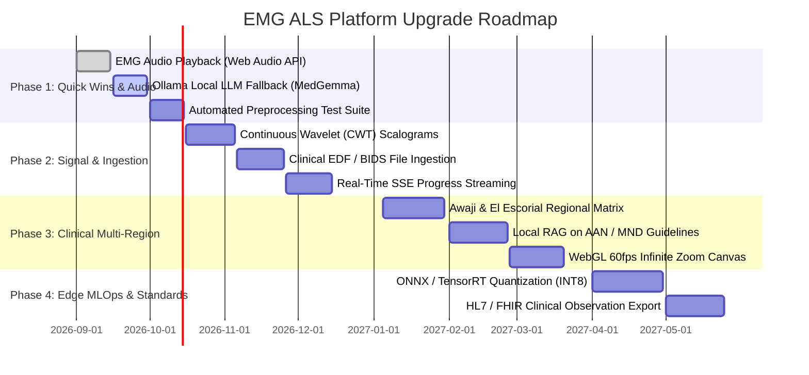
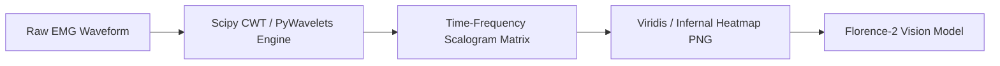
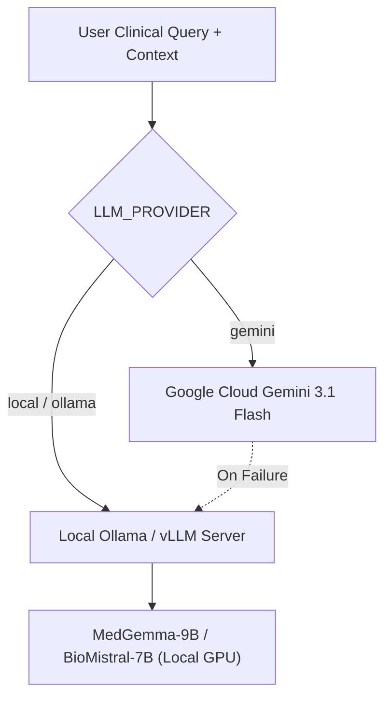

# Strategic Upgrade & Modernization Roadmap
## EMG ALS Multi-Modal AI Screening Platform

*Document Version:* 1.1.0  
*Horizon:* Short-Term (Phases 1-2: Q3-Q4 2026), Long-Term (Phases 3-4: 2027)  
*Status:* Architectural Blueprint & Technical RFCs  

---

## 1. Upgrade Roadmap & Implementation Timeline



---

## 2. Technical Blueprint: Upgrade Modules

### 2.1 Upgrade RFC-01: Continuous Wavelet Transform (CWT) Scalograms for VLM
* **Limitation Addressed:** Florence-2 currently reads a simple 2D line plot. High-frequency motor unit instability is obscured in static line plots.
* **Proposed Architecture:** Replace the line plot with a Morlet continuous wavelet transform (CWT) scalogram matrix:
  $$W(s, \tau) = \frac{1}{\sqrt{|s|}} \int_{-\infty}^{\infty} x(t) \psi^*\left(\frac{t - \tau}{s}\right) dt$$
  where $\psi(t) = \pi^{-1/4} e^{i \omega_0 t} e^{-t^2 / 2}$ is the Morlet mother wavelet.



* **Clinical Benefit:** Visualizes simultaneous time-localized recruitment loss alongside high-frequency fibrillation discharges in a single 2D RGB image.

---

### 2.2 Upgrade RFC-02: Native Clinical Format Ingestion (`.edf` / BIDS)
* **Limitation Addressed:** Real-world neurophysiology machines (Natus, Cadwell, Nihon Kohden) do not export raw `.npy` arrays during patient exams.
* **Architecture:** Integrate `pyedflib` and `mne` with an interactive channel selector:

```python
# RFC: signal_io.py extension
import pyedflib

def read_edf_channel(edf_path: Path, target_channel: str = "EMG_R_BICEPS") -> np.ndarray:
    with pyedflib.EdfReader(str(edf_path)) as f:
        labels = f.getSignalLabels()
        idx = labels.index(target_channel)
        orig_fs = f.getSampleFrequency(idx)
        raw = f.readSignal(idx)
        # Resample to pipeline standard 1,000 Hz if needed
        return resample_to_fixed_length(raw, orig_fs, target_fs=1000.0, target_length=23437)
```

---

### 2.3 Upgrade RFC-03: Local Offline LLM Integration (HIPAA Private Mode)
* **Limitation Addressed:** Cloud Gemini APIs cannot be used in air-gapped hospital intranets or environments governed by strict zero-cloud data sovereignty policies.
* **Proposed Architecture:** Dual-engine LLM router with automatic local failover:



---

### 2.4 Upgrade RFC-04: Awaji / Revised El Escorial Regional Diagnostic Matrix
* **Clinical Principle:** An ALS diagnosis cannot be established from one muscle. Under the **Awaji Criteria**, definite ALS requires lower motor neuron (LMN) + upper motor neuron (UMN) signs across $\ge 3$ of 4 anatomical regions:

```
+---------------------------------------------------------------------------------+
|                       AWAJI REGIONAL DIAGNOSTIC MATRIX                          |
+-------------------+----------------------------+--------------------------------+
| Anatomical Region | Target Muscles Evaluated   | Diagnostic Threshold           |
+-------------------+----------------------------+--------------------------------+
| 1. Bulbar         | Tongue, Masseter           | Active denervation + MUAP loss |
| 2. Cervical       | Biceps, First Dorsal Inter | Active denervation + MUAP loss |
| 3. Thoracic       | Paraspinal (T6-T10), Rectus| Active denervation + MUAP loss |
| 4. Lumbosacral    | Tibialis Anterior, Vastus  | Active denervation + MUAP loss |
+-------------------+----------------------------+--------------------------------+
```

* **Proposed UI/UX:** A multi-recording patient dashboard displaying body-map regional flags that dynamically aggregate individual signal inferences into a formal diagnostic confidence grade.

---

### 2.5 Upgrade RFC-05: Real-Time Web Audio EMG Playback
* **Clinical Principle:** Clinicians identify needle EMG discharges by sound. Fibrillations have a high-pitched click; fasciculations sound like irregular thuds.
* **Implementation:** Convert the 23,437-sample float array into an `AudioBuffer` played through the browser's `AudioContext`:

```javascript
// Frontend Audio Player implementation
const playEMGAudio = (signalArray: number[], fs = 1000) => {
  const audioCtx = new (window.AudioContext || window.webkitAudioContext)();
  const buffer = audioCtx.createBuffer(1, signalArray.length, fs * 8); // Scaled for audio audibility
  const data = buffer.getChannelData(0);
  for (let i = 0; i < signalArray.length; i++) {
    data[i] = signalArray[i] / 5.0; // Scaled to [-1.0, 1.0]
  }
  const source = audioCtx.createBufferSource();
  source.buffer = buffer;
  source.connect(audioCtx.destination);
  source.start();
};
```

---

### 2.6 Upgrade RFC-06: ONNX Runtime & INT8 Quantization
* **Target:** Accelerate CPU inference from 25 seconds to $< 1.5$ seconds for standard clinical laptop deployment.
* **Workflow:**
  1. Export PyTorch 1-D CNN to ONNX: `torch.onnx.export(cnn, dummy_input, "cnn.onnx")`
  2. Apply Post-Training Static Quantization (PTQ) via ONNX Runtime Quantizer to produce `cnn_int8.onnx`.
  3. Replace PyTorch inference calls with `onnxruntime.InferenceSession`.
  4. Memory footprint reduced from ~850MB to < 95MB.

---

### 2.7 Upgrade RFC-07: HL7 / FHIR Standard Clinical Observation Export

To enable seamless Electronic Health Record (EHR) integration (Epic, Cerner), results can be exported as a standard **FHIR R4 Observation** resource:

```json
{
  "resourceType": "Observation",
  "id": "als-screening-78fa1b9e",
  "status": "preliminary",
  "category": [
    {
      "coding": [
        {
          "system": "http://terminology.hl7.org/CodeSystem/observation-category",
          "code": "procedure",
          "display": "Procedure"
        }
      ]
    }
  ],
  "code": {
    "coding": [
      {
        "system": "http://loinc.org",
        "code": "18844-1",
        "display": "Electromyogram study"
      }
    ]
  },
  "valueCodeableConcept": {
    "coding": [
      {
        "system": "http://snomed.info/sct",
        "code": "86044005",
        "display": "Amyotrophic lateral sclerosis"
      }
    ]
  },
  "component": [
    {
      "code": { "text": "Screening Confidence" },
      "valueQuantity": { "value": 0.942, "unit": "probability" }
    },
    {
      "code": { "text": "Severity Tier" },
      "valueString": "Severe"
    }
  ]
}
```
