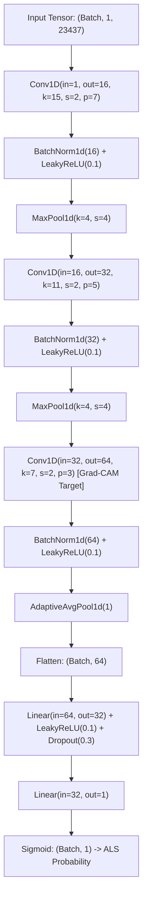
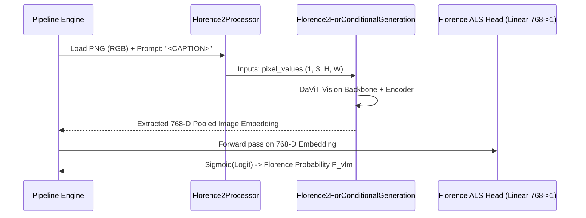
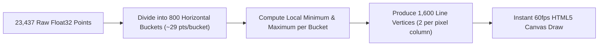

# Engineering & Machine Learning Implementation Guide
## EMG ALS Multi-Modal AI Screening Platform

*Document Version:* 1.1.0  
*Audience:* ML Engineers, Systems Developers, Neurophysiology Data Scientists  

---

## 1. 1-D Deep Convolutional Neural Network (CNN)

The 1-D CNN is designed specifically for raw single-channel electromyographic waveforms. It operates on the raw 23,437-point time series to capture microvolt-level Motor Unit Action Potential (MUAP) morphology, polyphasic turns, and rapid denervation transients without suffering from filtering phase distortion.

### 1.1 Layer Architecture & Tensor Dimensions



### 1.2 Mathematical Formulation of Latent Extraction
During standard inference, the model returns both the classification probability and the 64-dimensional latent embedding vector from the post-pooling layer:

$$\mathbf{z}_{\text{cnn}} = \text{AdaptiveAvgPool1D}(\text{LeakyReLU}(\text{BN}(\text{Conv3}(h_2)))) \in \mathbb{R}^{64}$$
$$P_{\text{cnn}} = \sigma\left(\mathbf{W}_2 \cdot \text{LeakyReLU}(\mathbf{W}_1 \mathbf{z}_{\text{cnn}} + \mathbf{b}_1) + b_2\right)$$

This 64-dimensional vector $\mathbf{z}_{\text{cnn}}$ is preserved and routed directly into the 838-D feature vector of the XGBoost meta-learner.

---

## 2. Florence-2 Vision-Language Model (VLM) Integration

### 2.1 Raster Plot Generation
The VLM does not ingest raw numerical arrays; it inspects a high-fidelity visual raster image of the preprocessed EMG interference pattern.

```python
# pipeline.py: render_signal_image
fig, ax = plt.subplots(figsize=(8, 2.5), dpi=150)
ax.plot(signal, color="#1a365d", linewidth=0.5, alpha=0.85)
ax.set_xlim(0, len(signal))
ax.axis("off")  # Zero axes or labels to prevent OCR bias
plt.savefig(image_path, bbox_inches="tight", pad_inches=0, dpi=150)
```



### 2.2 Fine-Tuned Projection Head
The 768-dimensional vision embedding $\mathbf{e}_{\text{vlm}}$ extracted from Florence-2's visual encoder is projected into binary classification space through a specialized linear head:
$$\text{logit}_{\text{vlm}} = \mathbf{W}_{\text{head}} \mathbf{e}_{\text{vlm}} + b_{\text{head}}, \quad \mathbf{W}_{\text{head}} \in \mathbb{R}^{1 \times 768}$$
$$P_{\text{vlm}} = \frac{1}{1 + e^{-\text{logit}_{\text{vlm}}}}$$

---

## 3. Explainable AI (XAI) Algorithms

### 3.1 1-D Grad-CAM (Gradient-Weighted Class Activation Mapping)
To localize pathological denervation events in time without requiring sample-level labels, we compute Grad-CAM on the feature maps of the third convolutional layer (`conv3`):

1. **Forward Hook:** Capture forward activation maps $A^k \in \mathbb{R}^{L_{\text{feat}}}$ for each of the $K=64$ channels.
2. **Backward Hook:** Compute gradients of the unnormalized output score $Y$ with respect to each feature map:
   $$\alpha_k = \frac{1}{L_{\text{feat}}} \sum_{i=1}^{L_{\text{feat}}} \frac{\partial Y}{\partial A_i^k}$$
3. **Channel Weighting & Rectification:**
   $$L_{\text{Grad-CAM}}[t] = \text{ReLU}\left( \sum_{k=1}^{64} \alpha_k A^k[t] \right)$$
4. **Interpolation & Normalization:** The 1-D profile is linearly interpolated back to the original length ($N = 23,437$) and min-max scaled to $[0.0, 1.0]$. Peaks in this curve pinpoint the millisecond windows driving the neural network's pathology detection.

### 3.2 Tree SHAP (SHapley Additive exPlanations)
To explain the XGBoost meta-learner's decision, we apply `shap.TreeExplainer` on the 838-D feature vector:
$$\phi_i(x) = \sum_{S \subseteq F \setminus \{i\}} \frac{|S|!(|F| - |S| - 1)!}{|F|!} \left[ f_x(S \cup \{i\}) - f_x(S) \right]$$
The system extracts the top 5 features with the highest absolute attribution $|\phi_i|$ and labels them with human-readable clinical descriptions (e.g., "Florence Vision Latent #312", "Waveform Temporal Probability", "Inter-Model Agreement").

---

## 4. Clinical AI Assistant Guardrails & Emoji Stripping

To comply with clinical documentation norms and prevent hallucinations, the chat orchestrator enforces rigorous prompt design and output sanitation:

```mermaid
flowchart TD
    UserQuery[User Inters Clinical Question] --> Injection[Combine SYSTEM_PROMPT + Patient Context]
    Injection --> ContextWindow[Enforce 6-Turn History Window]
    ContextWindow --> GeminiAPI[Call Google Gemini 3.1 / 2.5 API]
    GeminiAPI --> RawOutput[Raw Model Output Text]
    RawOutput --> EmojiRegex["Regex Strip Unicode Emojis (\\U0001F600 - \\U0001FAFF)"]
    EmojiRegex --> Splitter["Split on '---' Separator"]
    Splitter --> Answer[Clinical Markdown Reply]
    Splitter --> Suggestions[Structured Follow-up Questions (Max 3)]
```

### 4.1 Emoji Sanitization Implementation
```python
EMOJI_PATTERN = re.compile(
    "[\U0001F600-\U0001F64F\U0001F300-\U0001F5FF\U0001F680-\U0001F6FF"
    "\U0001F1E0-\U0001F1FF\U00002702-\U000027B0\U000024C2-\U0001F251"
    "\U0001F900-\U0001F9FF\U0001FA70-\U0001FAFF]+",
    flags=re.UNICODE,
)

def strip_emojis(text: str) -> str:
    return EMOJI_PATTERN.sub("", text)
```

---

## 5. High-Performance Frontend Waveform Decimation

Rendering 23,437 raw vertices on an HTML5 canvas of 800px width causes severe graphical aliasing and browser jank. The frontend implements a **Min/Max Decimation Algorithm**:



This ensures that all sharp needle EMG spikes (fibrillations and high-amplitude polyphasics) remain visually prominent without dropping peak amplitudes.
