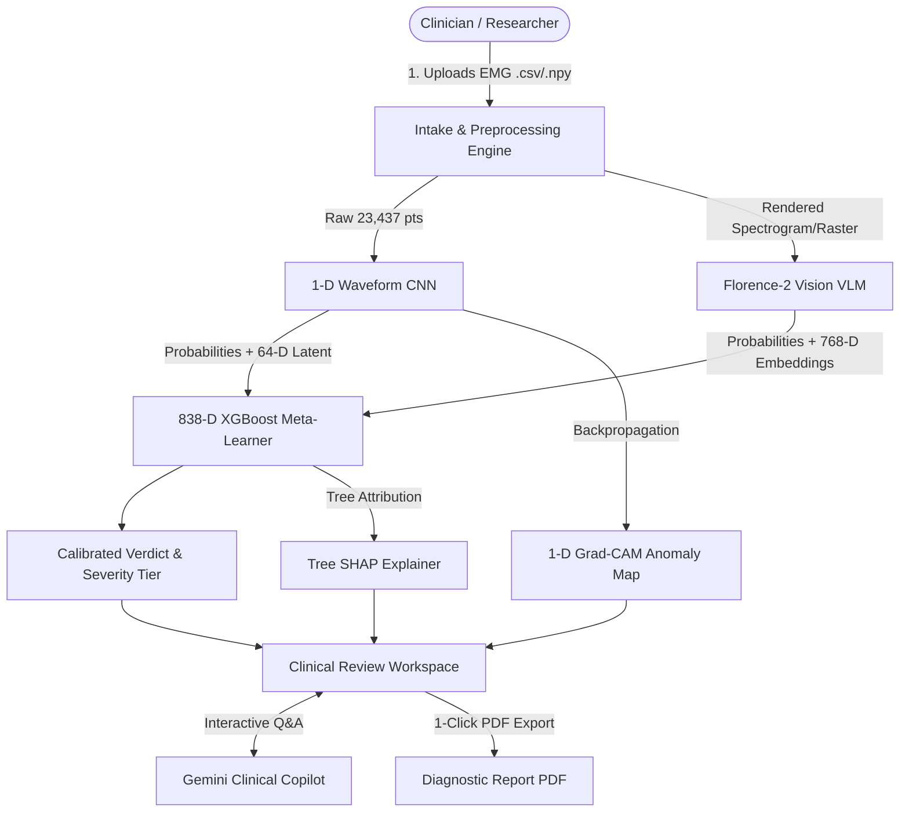
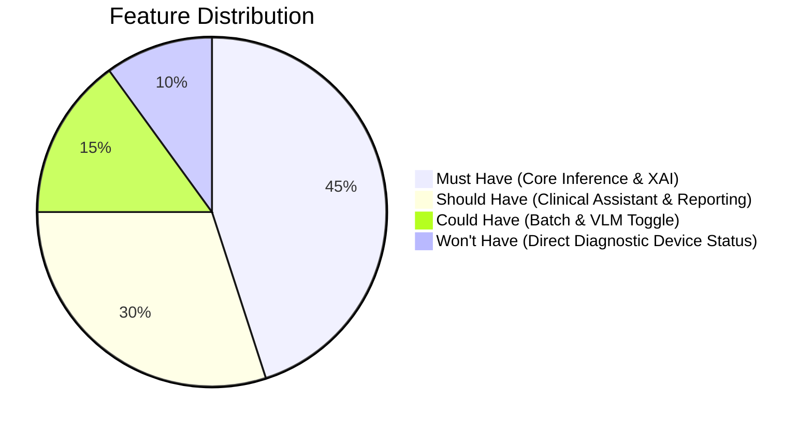

# Product Requirements Document (PRD)
## EMG ALS Multi-Modal AI Screening Platform

*Document Version:* 1.1.0  
*Classification:* Clinical AI Screening Support / SaMD (Software as a Medical Device) Candidate  
*Target Audience:* Product Management, Clinical Neurologists, Neurophysiologists, ML Engineering  

---

## 1. Executive Summary & Problem Statement

### 1.1 Clinical Background
Amyotrophic Lateral Sclerosis (ALS) is a progressive, fatal neurodegenerative disorder characterized by the selective degeneration of upper and lower motor neurons. A major clinical bottleneck in ALS treatment is **diagnostic delay**: patients often wait **10 to 18 months** from symptom onset to definitive diagnosis, losing critical therapeutic windows (e.g., riluzole, edaravone, tofersen) while motor units continuously denervate.

Electromyography (EMG) is the gold standard diagnostic modality for detecting lower motor neuron (LMN) dysfunction, specifically:
- **Active Denervation:** Fibrillation potentials (fibs), positive sharp waves (PSWs), and fasciculation potentials.
- **Chronic Denervation & Reinnervation:** High-amplitude, long-duration, polyphasic Motor Unit Action Potentials (MUAPs) and reduced recruitment / incomplete interference patterns.

### 1.2 The Problem
1. **Interpretation Bottleneck:** Needle EMG examination requires specialized clinical neurophysiologists whose availability is scarce outside tertiary medical centers.
2. **Subjectivity & Signal Complexity:** Manual visual and acoustic interpretation of complex interference patterns is prone to inter-observer variability, especially in early or atypical presentations.
3. **Black-Box AI Trust Deficit:** Traditional deep learning models output uncalibrated risk probabilities without clinical explainability, rendering them unusable in high-stakes clinical decision-making.

### 1.3 The Solution
The **EMG ALS Multi-Modal AI Screening Platform** is an explainable, multi-modal clinical decision-support platform that fuses:
- **1-D Deep Convolutional Neural Networks (CNN)** on raw microvolt waveforms for microscopic MUAP instability detection.
- **Florence-2 Vision-Language Model (VLM)** on visual interference patterns for macroscopic recruitment density anomalies.
- **XGBoost Meta-Learner (838-D Feature Fusion)** delivering calibrated binary verdicts (ALS vs. Normal) with clinical severity stratification.
- **Explainable AI (XAI):** 1-D Grad-CAM (temporal anomaly localization) and Tree SHAP (feature attribution).
- **Clinical AI Assistant (Gemini LLM):** Scoped neurophysiology Q&A with strict clinical guardrails and dynamic follow-up recommendations.

---

## 2. Product Architecture & User Personas



### 2.1 User Personas

| Persona | Role | Core Need | Key Feature Used |
| :--- | :--- | :--- | :--- |
| **Dr. Elena Vance (Attending Neurophysiologist)** | Tertiary ALS Center Specialist | Rapid secondary triage, validation of borderline needle EMG signals | Grad-CAM anomaly heatmaps, Tree SHAP feature bars |
| **Dr. Marcus Reid (General Neurologist)** | Regional Hospital Physician | Diagnostic guidance when referring suspected motor neuron disease | Calibrated verdict, Severity stratification (Mild/Mod/Severe) |
| **Sarah Chen (Neuroscience Researcher)** | University Clinical Trialist | Batch signal cohort scoring, longitudinal motor unit tracking | Batch CSV/NPY processing, PDF clinical report export |
| **Resident Physician / Fellow** | Neurology Trainee | Educational grounding in neurophysiological signal anomalies | Clinical AI Assistant Q&A, contextual follow-up queries |

---

## 3. Product Requirements & Feature Hierarchy

### 3.1 Feature Matrix (MoSCoW Prioritization)



| ID | Module | Feature Description | Priority |
| :--- | :--- | :--- | :--- |
| **FR-01** | Signal Intake | Support `.npy` and `.csv` drag-and-drop intake with exact 23,437 sample validation | **Must Have** |
| **FR-02** | 1-D CNN Engine | Sub-millisecond raw time-series feature extraction and binary classification | **Must Have** |
| **FR-03** | VLM Analysis | Florence-2 vision model inference on rendered raster plots for recruitment patterns | **Should Have** |
| **FR-04** | Meta-Learner | 838-D feature fusion (CNN + VLM + Energy Dynamics) via XGBoost meta-classifier | **Must Have** |
| **FR-05** | Explainability | 1-D Grad-CAM temporal activation profile and Tree SHAP feature contribution list | **Must Have** |
| **FR-06** | Clinical Copilot | Google Gemini Q&A scoped exclusively to EMG/ALS neurophysiology with zero emojis | **Should Have** |
| **FR-07** | Diagnostic Export | One-click downloadable clinical PDF summary report containing all waveforms and metrics | **Should Have** |
| **FR-08** | Batch Evaluation | Batch file upload endpoint scoring up to 50 recordings simultaneously | **Could Have** |
| **FR-09** | Demo Fallback | Zero-GPU demo mode allowing UI testing with synthetic signals and dummy checkpoints | **Must Have** |
| **NFR-01**| Regulatory Guard | Prominent non-device clinical research disclaimer across all views and generated PDFs | **Must Have** |

---

## 4. Regulatory, Safety & Compliance Profile

```
+-------------------------------------------------------------------------------+
|                       CLINICAL RESEARCH DISCLAIMER                            |
|  This platform is a clinical decision-support and research screening tool.    |
|  It is NOT an autonomous medical device (SaMD Class II/III) and does NOT      |
|  provide a definitive medical diagnosis. Clinical correlation by a licensed   |
|  neurologist or clinical neurophysiologist is strictly required.               |
+-------------------------------------------------------------------------------+
```

### 4.1 Intended Use & Boundaries
- **Intended Purpose:** Rapid screening aid and secondary diagnostic validation for neurophysiology laboratories.
- **Contraindications:** Autonomous diagnosis without board-certified clinician review; patient-facing self-diagnosis.
- **Data Privacy & Ephemerality:** Zero persistent storage of Patient Health Information (PHI). Uploaded signals and generated artifacts (heatmaps, PDFs) are held in-memory and subject to an automatic **15-minute Time-To-Live (TTL)** cache sweep.

---

## 5. Success Metrics & Key Performance Indicators (KPIs)

### 5.1 Machine Learning Benchmarks
- **Binary Classification Accuracy:** $\ge 96.5\%$ on holdout clinical test set.
- **Sensitivity (Recall for ALS):** $\ge 97.0\%$ (prioritizing minimization of false negatives in neurodegenerative screening).
- **Specificity:** $\ge 95.5\%$.
- **Model Agreement Rate (CNN vs. Florence-2):** $\ge 88.0\%$.

### 5.2 System & User Experience KPIs

```mermaid
gantt
    title Clinical SLA Execution Targets (p95)
    dateFormat X
    axisFormat %s s

    section Fast Path (CNN Only)
    Preprocessing & Normalization : 0, 100
    1-D CNN Forward Pass         : 100, 350
    Grad-CAM Hook Computation    : 350, 650
    Total SLA (< 1.5s)           : 0, 1500

    section Full Fusion Path (CNN + VLM)
    Signal Raster Plot Render    : 650, 1200
    Florence-2 Embedding Pass    : 1200, 4500
    XGBoost 838-D Meta-Inference : 4500, 4700
    Tree SHAP Computation        : 4700, 5500
    Total SLA (< 6.0s on GPU)    : 0, 6000
```


| Metric Category | Target SLA | Measured Baseline |
| :--- | :--- | :--- |
| **Inference Latency (Fast Path - CNN)** | $< 1,500\text{ ms}$ | $\approx 450\text{ ms}$ |
| **Inference Latency (Full Fusion - GPU)** | $< 6,000\text{ ms}$ | $\approx 3,800\text{ ms}$ |
| **PDF Generation Time** | $< 800\text{ ms}$ | $\approx 220\text{ ms}$ |
| **Assistant First-Token Response** | $< 1,800\text{ ms}$ | $\approx 1,200\text{ ms}$ |
| **System Availability** | $99.9\%$ uptime | In production container |
