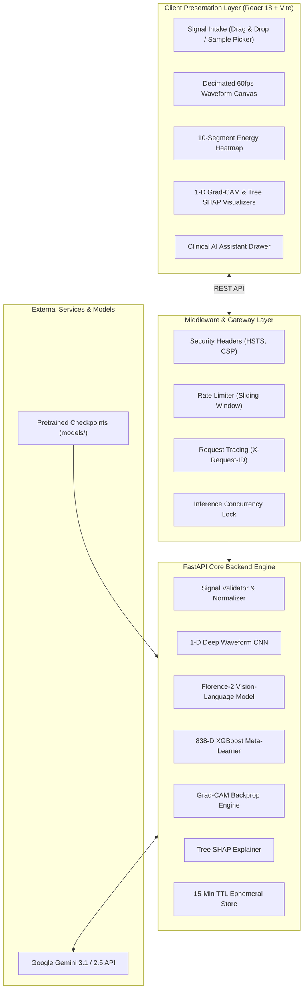
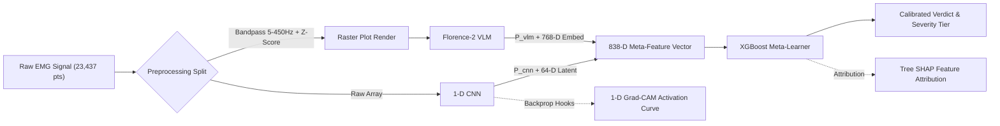

# Clinical Neurophysiology & AI Platform Documentation
## EMG ALS Multi-Modal Screening Platform

Welcome to the central technical and clinical documentation suite for the **EMG ALS Multi-Modal AI Screening Platform**.

This documentation suite provides an end-to-end reference for product managers, clinical neurophysiologists, machine learning engineers, and software architects.

---

## 📚 Documentation Catalog

| Document | File Link | Focus Area & Contents |
| :--- | :--- | :--- |
| **Product Requirements (PRD)** | [PRD.md](file:///c:/Users/Pritam/Downloads/medicalllm/als-screening-github/docs/PRD.md) | Clinical background, ALS diagnostic delay problem statement, SaMD regulatory boundaries, user personas, functional requirements, clinical KPIs. |
| **Technical Requirements (TRD)** | [TRD.md](file:///c:/Users/Pritam/Downloads/medicalllm/als-screening-github/docs/TRD.md) | System architecture, runtime execution profiles (GPU vs. CPU), latency SLAs, memory bounds, security middleware, and configuration parameters. |
| **Backend & Data Schema** | [BACKEND_SCHEMA.md](file:///c:/Users/Pritam/Downloads/medicalllm/als-screening-github/docs/BACKEND_SCHEMA.md) | Complete REST API endpoint catalog, 838-D feature vector memory layout, Pydantic schemas, and ephemeral TTL store lifecycle. |
| **Application & User Flow** | [APP_FLOW.md](file:///c:/Users/Pritam/Downloads/medicalllm/als-screening-github/docs/APP_FLOW.md) | User journey flowcharts, React UI state machine, signal ingestion & validation pipeline, Gemini assistant loop, and error handling. |
| **Implementation Guide** | [IMPLEMENTATION.md](file:///c:/Users/Pritam/Downloads/medicalllm/als-screening-github/docs/IMPLEMENTATION.md) | Deep math & code walkthrough: 1-D CNN tensor dimensions, Florence-2 VLM embeddings, XGBoost fusion, 1-D Grad-CAM, Tree SHAP, and canvas decimation. |
| **Future Upgrade Roadmap** | [FUTURE_UPGRADES.md](file:///c:/Users/Pritam/Downloads/medicalllm/als-screening-github/docs/FUTURE_UPGRADES.md) | Phased modernization RFCs: CWT Wavelet scalograms, native `.edf` clinical ingestion, local offline LLMs (Ollama), Awaji multi-muscle matrix, and FHIR export. |

---

## 🏗️ End-to-End System Architecture

---

## ⚡ Multimodal Inference & Calibration Pipeline

---

## 🛡️ Clinical Research Disclaimer
*This platform is designed strictly as a clinical decision-support and academic research tool. It is not an FDA-cleared diagnostic device and must not be used as the sole basis for clinical diagnosis or patient intervention without review by a qualified physician or clinical neurophysiologist.*
