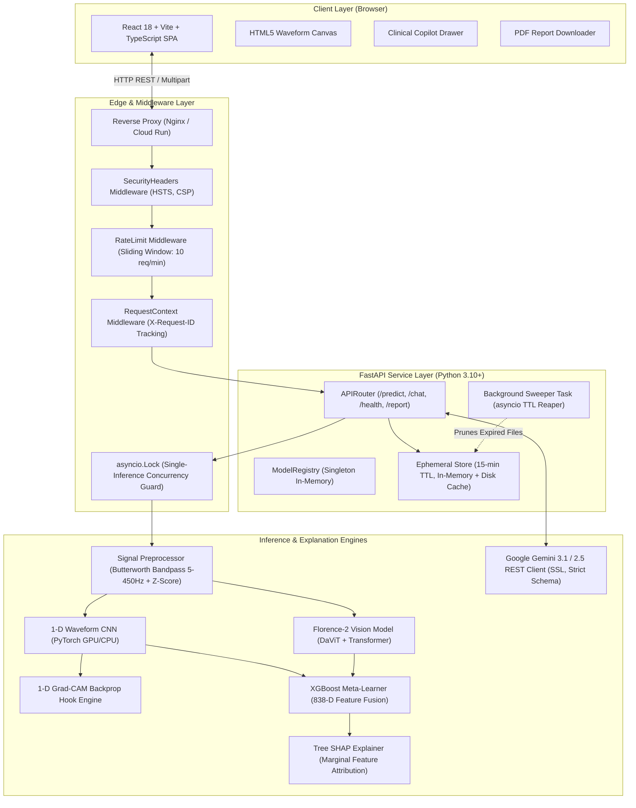
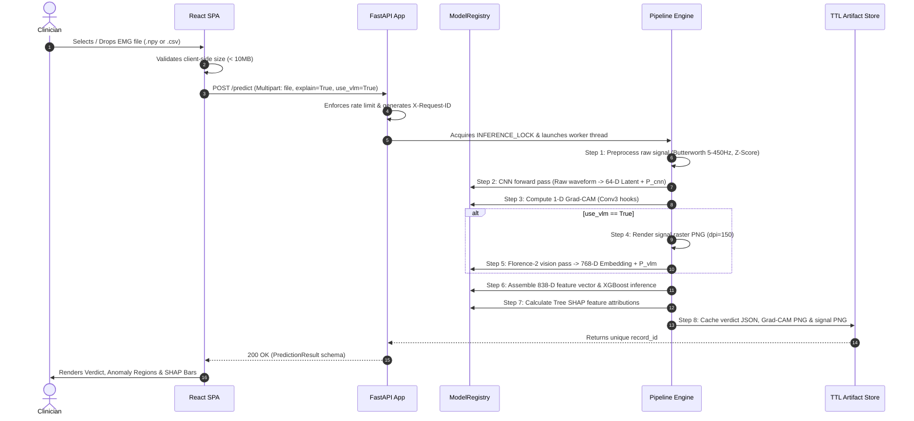
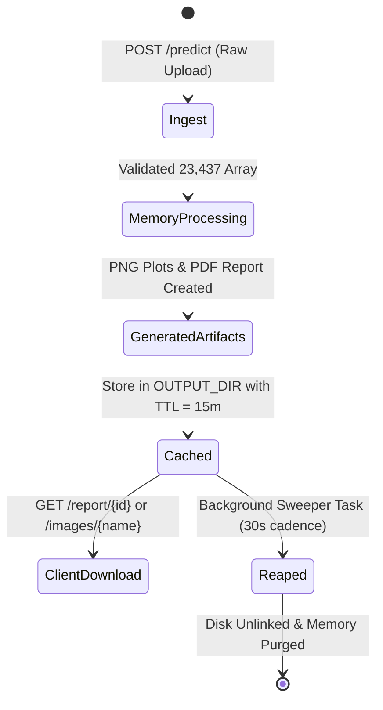

# Technical Requirements Document (TRD)
## EMG ALS Multi-Modal AI Screening Platform

*Document Version:* 1.1.0  
*Engineers:* ML Engineering, Backend Systems, Frontend Infrastructure  
*Stack:* Python 3.10+, FastAPI, PyTorch 2.2+, Transformers 4.49, XGBoost 2.0+, React 18, Vite, TypeScript  

---

## 1. System Architecture Overview



---

## 2. Hardware Envelopes & Runtime Profiles

The platform supports two runtime modes: **Production GPU** (Recommended) and **Edge CPU** (Degraded VLM fallback).

```
+-----------------------------------------------------------------------------------+
|                            RUNTIME HARDWARE MATRIX                                |
+------------------------+---------------------------------+------------------------+
| Metric                 | Production GPU (Optimal)        | Edge CPU (Fallback)    |
+------------------------+---------------------------------+------------------------+
| Compute Target         | NVIDIA T4 / A10G / L4 (CUDA 12) | 8 vCPU (x86_64 / ARM64)|
| System RAM             | 16 GB Minimum                   | 16 GB Minimum          |
| Dedicated VRAM         | 6 GB Minimum (8 GB Preferred)   | N/A (Shared RAM)       |
| PyTorch Device         | `cuda:0` (FP16 / FP32)          | `cpu` (FP32)           |
| Full Fusion Latency    | ~3.5 to 4.5 seconds             | ~18 to 35 seconds      |
| Fast-Path CNN Latency  | ~180 to 300 milliseconds        | ~450 to 800 ms         |
| Concurrency Strategy   | 1 Active Task / GPU Core        | 1 Active Task / Worker |
+------------------------+---------------------------------+------------------------+
```

### 2.1 Concurrency & Memory Safeguard
Florence-2 and Qwen backbones are memory-intensive and not thread-safe under parallel backward/forward passes. Concurrency is strictly bounded:
```python
# main.py
INFERENCE_LOCK = asyncio.Lock()

async with INFERENCE_LOCK:
    result = await asyncio.to_thread(run_pipeline, reg, signal_array, ...)
```
Higher system throughput is scaled horizontally via independent worker containers behind a round-robin load balancer.

---

## 3. Multi-Modal Pipeline Specifications



### 3.1 Preprocessing Pipeline Math
1. **Bandpass Filtering:** 4th-order Butterworth digital filter with zero-phase forward-backward filtering (`scipy.signal.filtfilt`):
   $$\text{Passband: } 5.0\text{ Hz} \le f \le 450.0\text{ Hz}, \quad f_s = 1000.0\text{ Hz}$$
   $$\text{Normalized cutoff: } \omega_n = \frac{f}{\frac{1}{2}f_s}$$
2. **Z-Score Amplitude Normalization:**
   $$x_{\text{norm}}[t] = \frac{x[t] - \mu}{\sigma + 10^{-8}}, \quad \text{where } \mu = \frac{1}{N}\sum_{t=1}^N x[t], \; \sigma = \sqrt{\frac{1}{N}\sum_{t=1}^N (x[t] - \mu)^2}$$
3. **Signal Segmentation:**
   $$L = 23,437 \text{ samples}, \quad K = 10 \text{ segments}, \quad \text{len}(S_k) = \lfloor 2343.7 \rfloor$$
   $$\text{Segment Energy: } E_k = \frac{1}{|S_k|} \sum_{t \in S_k} x[t]^2$$
   $$\text{Abnormality Threshold: } \tau = \overline{E} + \text{std}(E)$$

---

## 4. Security, Middleware & Data Lifecycle

### 4.1 Security Middleware Stack
- **`SecurityHeadersMiddleware`:** Enforces `Strict-Transport-Security` (HSTS max-age 31536000), `X-Content-Type-Options: nosniff`, `X-Frame-Options: DENY`, `Referrer-Policy: strict-origin-when-cross-origin`, and Content Security Policy (CSP).
- **`RateLimitMiddleware`:** Sliding-window rate limiter per client IP (Default: 10 predictions per minute per IP, returning HTTP 429 upon exhaustion).
- **`RequestContextMiddleware`:** Injects UUIDv4 `X-Request-ID` into every HTTP transaction for end-to-end tracing.
- **Upload Hard Bounds:** Pre-flight checking of `Content-Length` and capped streaming reading (`MAX_UPLOAD_MB = 10MB`).

### 4.2 Ephemeral Data Lifecycle (No Persistent PHI)



---

## 5. Configuration Environment Variables

| Variable | Type | Default | Description |
| :--- | :--- | :--- | :--- |
| `ENV` | `string` | `"development"` | Environment profile (`"production"`, `"staging"`, `"development"`). |
| `DEVICE` | `string` | `"auto"` | Target compute backend: `"auto"`, `"cuda"`, `"cpu"`. |
| `PORT` | `int` | `8000` | Backend API server port. |
| `ENABLE_FLORENCE` | `bool` | `True` | Global gate for Florence-2 VLM availability. |
| `FLORENCE_DEFAULT` | `bool` | `False` | Whether VLM is enabled by default if client omits flag. |
| `ENABLE_LLM` | `bool` | `True` | Activates Clinical Copilot Q&A capabilities. |
| `LLM_PROVIDER` | `string` | `"gemini"` | Copilot engine (`"gemini"` or `"local"`). |
| `GEMINI_API_KEY` | `string` | `""` | Google Cloud Gemini API key for clinical chat. |
| `ARTIFACT_TTL_MINUTES`| `int` | `15` | Retention duration for ephemeral diagnostic plots and PDFs. |
| `RATE_LIMIT` | `int` | `10` | Max requests per sliding window per IP. |
| `MAX_BATCH_SIZE` | `int` | `50` | Maximum simultaneous file uploads in `/predict/batch`. |
